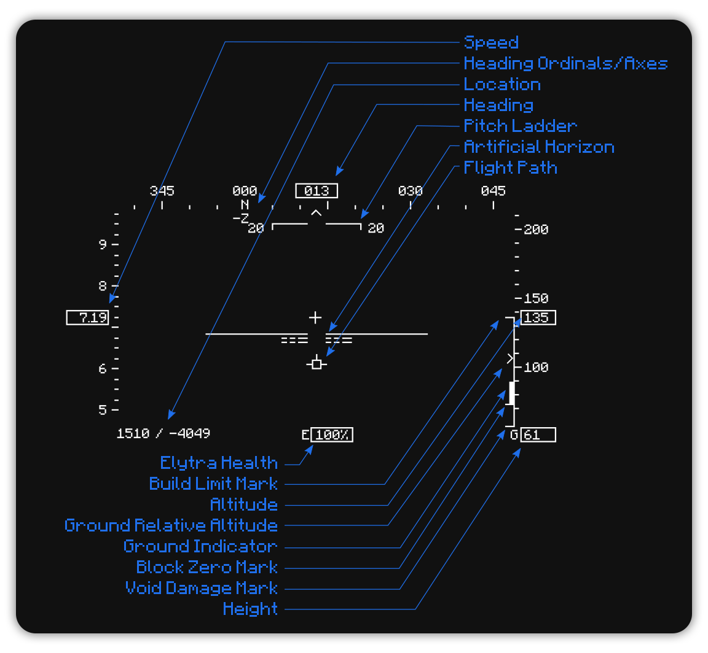

    

**Flight HUD** is a client side Fabric Minecraft Mod that adds a flight style HUD like one you would see in a flight simulator.

    <a href="https://modrinth.com/mod/fabric-api/">
        </img>
    </a>
    </img>

## Features

Diagram

- Air Speed with sliding scale
- Heading Ordinals/Axes with sliding scale
- Location in X and Z coordinates
- Pitch Ladder
- Artificial Horizon
- Flight Path (Progade Vector)
- Elytra Health
- Build Limit Mark
- Altitude with sliding scale (relative to block zero)
- Ground Relative Altitude
- Ground Indicator
- Block Zero Mark
- Void Damage Mark
- Height (distance from ground)
