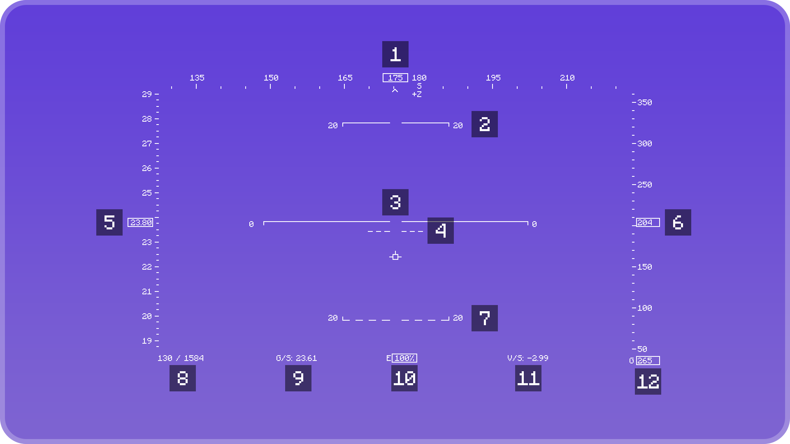

    

    
    
    <!-- uncomment if Forge version is released (https://github.com/Octol1ttle/FlightAssistant/pull/2#discussion_r1370700775)
    <a href="https://modrinth.com/mod/flightassistant/versions?l=forge">
        </img></a>
    -->

---

**FlightAssistant** is a client side Minecraft mod that adds a flight style HUD
(like one you would see in a flight simulator), autopilot systems, flight protections, and some more features.

## Main Features

- Flight HUD
- Stall protection1, warning and automatic recovery2
- Ground Proximity Warning System (GPWS):
  - Sinkrate warning, protection1 and automatic recovery
  - Unsafe terrain clearance warning, protection1 and automatic recovery2
- Autopilot systems:
  - Flight Planner
  - Flight Directors
  - Auto-firework
  - Auto pilot
- Alerts for unsafe flight conditions:
  - Low elytra durability
  - Approaching void damage altitude
  - No response from fireworks
  - Unsafe (explosive) fireworks
  - Low firework count/no fireworks in inventory

1 Protection via blocked pitch changes 
2 Automatic recovery via automatic pitch changes and firework usage

## HUD Features

    
Diagram

    

1. Heading
2. Positive pitch
3. Pitch ladder
4. Optimum glide pitch
5. Speed
6. Altitude
7. Negative pitch
8. Coordinates (X / Z)
9. Ground Speed
10. Elytra Health
11. Vertical Speed
12. Height above ground/void

#
<b>FlightAssistant</b> is an unofficial continuation of <a href="https://github.com/frodare/FlightHud">FlightHUD</a> mod by <a href="https://github.com/frodare">frodare</a>.
